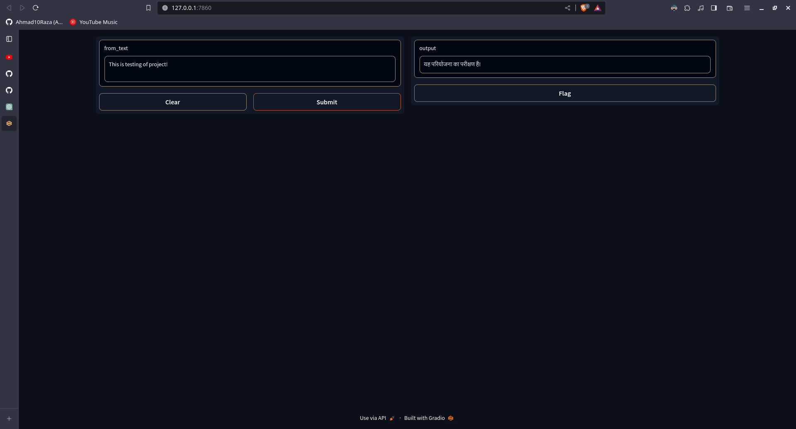

# English to Hindi Translation Web App

This repository contains the source code for a web application that translates English text to Hindi using a pre-trained machine translation model. The application provides a user-friendly interface for users to input English text and receive the corresponding Hindi translation.

## Features

- Translation of English text to Hindi
- Simple and intuitive web interface

## Getting Started

### Prerequisites

- Python 3.x
- Flask (install using `pip install Flask`)
- Hugging Face Transformers (install using `pip install transformers`)

### Installation

1. Clone the repository:

   ```bash
   git clone https://github.com/Ahmad10Raza/Translation-WebApp-English-To-Hindi.git
   ```
2. Change into the project directory:

   ```bash
   cd Translation-WebApp-English-To-Hindi
   ```
3. Install dependencies:

   ```bash
   pip install -r requirements.txt
   ```

### Usage

1. Run the Flask application:

   ```bash
   python app.py
   ```
2. Open your web browser and go to [http://localhost:5000](http://localhost:5000)
3. Enter English text in the input box and click the "Translate" button to see the Hindi translation.

# Output

## Contributing

If you would like to contribute to the project, please follow the guidelines in [CONTRIBUTING.md](CONTRIBUTING.md).

## License

This project is licensed under the [MIT License](LICENSE).

## Acknowledgments

### HuggingFcae [](https://huggingface.co/)
